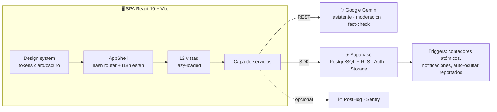

<div align="center">

# ✦ NOVA

### *Tu país, tus datos, tu decisión.*

Plataforma cívica independiente para las elecciones de **Costa Rica 2026** 🇨🇷
Comparador electoral · Red social ciudadana · IA con fuentes oficiales

[](https://github.com/josueazc/VoteOn2/actions)
[](docs/GROWTH.md)
[](https://github.com/josueazc/VoteOn2/pulls)

<br/>


</div>

---

## 🗳️ ¿Qué es NOVA?

En época electoral, el problema no es la falta de información — es el exceso
sin contexto. NOVA toma los datos oficiales del TSE y la Asamblea Legislativa
y los convierte en herramientas que cualquier persona puede usar en 5 minutos:
comparar propuestas por tema, verificar afirmaciones con IA, y debatir en una
comunidad moderada. **Sin sesgos, sin pauta, sin partido.**

## ✨ Módulos

| | Módulo | Qué hace |
| --- | --- | --- |
| ⚖️ | **Comparador político** | 7 temas, frente a frente entre partidos, mapa ideológico interactivo y análisis comparativo con IA |
| 💬 | **Comunidad (DebateCR)** | Posts, hashtags, tendencias, seguidores, guardados, perfiles verificados y moderación IA pre-publicación |
| 🤖 | **Asistente IA** | Chatbot estricto basado en documentos (PDF/TXT) y fuentes oficiales; multilingüe |
| 🔍 | **Fact-checking** | Veredicto en 6 niveles con barra de confianza y fuentes sugeridas |
| 🧭 | **Test de afinidad** | Brújula ideológica con temas de actualidad |
| 🏛️ | **La Asamblea** | Votaciones, asistencias y proyectos de ley |
| 📊 | **Participación** | Métricas abiertas por provincia, exportar CSV/PDF |
| 🔔 | **Notificaciones** | Generadas por el servidor (triggers), con filtros |

## 🏗️ Arquitectura



**Principios:** los componentes nunca hablan con Supabase directamente (capa
de servicios) · los datos electorales viven en [`src/data/`](src/data/)
editables sin tocar UI · los contadores los mantiene el servidor · la IA
degrada con gracia sin API key.

## 🚀 Empezar

```bash
git clone https://github.com/josueazc/VoteOn2.git
cd VoteOn2
npm install
cp .env.example .env   # completa Supabase y Gemini
npm run dev
```

1. 🗄️ Crea un proyecto en [Supabase](https://supabase.com) y ejecuta
   [`supabase/migrations/00_init.sql`](supabase/migrations/00_init.sql)
   → guía completa en [supabase/README.md](supabase/README.md)
2. 📦 Crea el bucket público `comunidad_media` en Storage
3. 🔑 Consigue tu API key en [Google AI Studio](https://aistudio.google.com/apikey)

```bash
npm test         # 29 tests (Vitest + RTL)
npm run build    # bundle inicial ~255 kB gracias al code splitting
```

## ☁️ Despliegue

SPA estática: funciona out-of-the-box en **Vercel** o **Netlify**
(framework Vite, build `npm run build`, output `dist`, variables `VITE_*`
en el panel). CI corre tests + build en cada push.

## ⛓️ Roadmap Web3 (explorando)

NOVA es una plataforma de *confianza pública* — exactamente el problema que
blockchain resuelve bien cuando se usa con criterio. Ideas en evaluación:

- **Anclaje de integridad:** hash de cada fact-check y snapshot del comparador
  anclado on-chain → cualquiera puede auditar que no se editó después.
- **Insignias soulbound:** verificación de candidatos y embajadores como
  tokens intransferibles.
- **Sondeos resistentes a manipulación:** consultas comunitarias con
  commit-reveal o pruebas zk (no elecciones reales — eso es del TSE).
- **Transparencia de fondos:** donaciones en cripto con libro público.

Detalle y trade-offs en la sección Web3 de [docs/GROWTH.md](docs/GROWTH.md).

## 🤝 Neutralidad

NOVA **no recomienda votar por ningún partido**. Los resúmenes del comparador
son síntesis editoriales neutrales marcadas como tales; las posiciones
ideológicas son estimaciones educativas. Consulta siempre los planes oficiales
en el [TSE](https://www.tse.go.cr) antes de decidir tu voto.

## 🧑‍💻 Contribuir

Issues y PRs bienvenidos — corre `npm test` antes de enviar.
Plan de crecimiento y decisiones abiertas: [docs/GROWTH.md](docs/GROWTH.md).

<div align="center">
<sub><strong>Libertad · Justicia · Pura Vida</strong> — hecho en Costa Rica 🇨🇷</sub>
</div>
